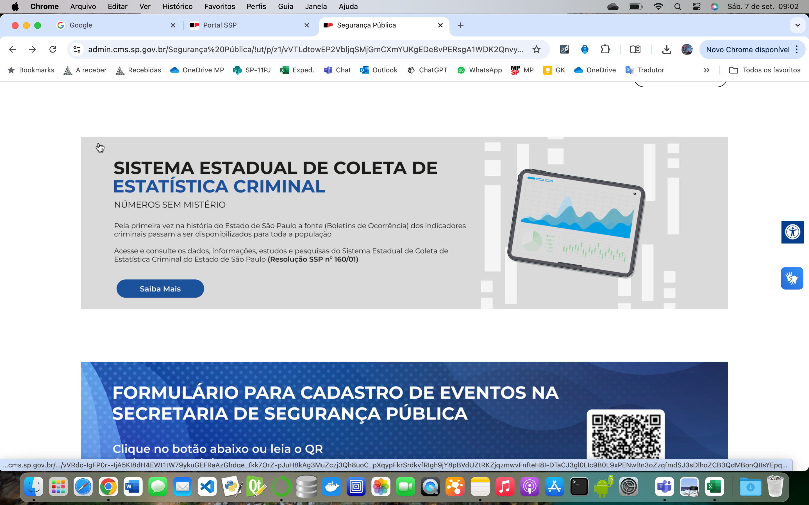

## dados_criminais_ssp_sp
# Análise dos dados criminais georreferenciados da SSP/SP

## Introdução

A SSP/SP está disponibilizando para toda a população os dados criminais georreferenciados relativos aos boletins de ocorrência. 

Trata-se de uma iniciativa muito importante, que fomentará análises independentes, como a que ora se apresenta, e a participação da sociedade na formulação de políticas de segurança pública.

Este projeto realiza a análise de dados criminais, utilizando bibliotecas como `pandas`, `ipywidgets` e `folium` para visualização de dados em mapas interativos.

O uso do Colab facilita a reprodução.

## Descrição

O script processa um arquivo Excel com dados criminais e permite que o usuário filtre as informações por município. Além disso, é possível visualizar os dados em um mapa interativo com marcadores, que são agrupados de acordo com as ocorrências.

## Pré-requisitos

As seguintes bibliotecas são necessárias para executar o código:

- `pandas`
- `ipywidgets`
- `folium`
- `openpyxl` (para leitura de arquivos Excel)
- `Jupyter Notebook` (opcional, para execução interativa)

## Como Executar

1. Abra o Colab e carregue o arquivo de dados obtido no site da SSP/SP (`SPDadosCriminais_2024.xlsx` ou equivalente).
2. Execute as células (uma a uma, caso deseje fazer seleções com os widgets).

## Uso

O código permite que você selecione o município de interesse para filtrar os dados e visualizar estatísticas criminais específicas. O mapa gerado mostra ocorrências agrupadas e informações adicionais sobre os incidentes.

Note que o programa salva o mapa em html, permitindo o fácil compartilhamento.

## Contribuições

Sinta-se à vontade para contribuir para o projeto. Crie um *pull request* com suas melhorias ou sugestões.

## Licença

Este projeto está licenciado sob a licença MIT - veja o arquivo [LICENSE](LICENSE) para mais detalhes.
